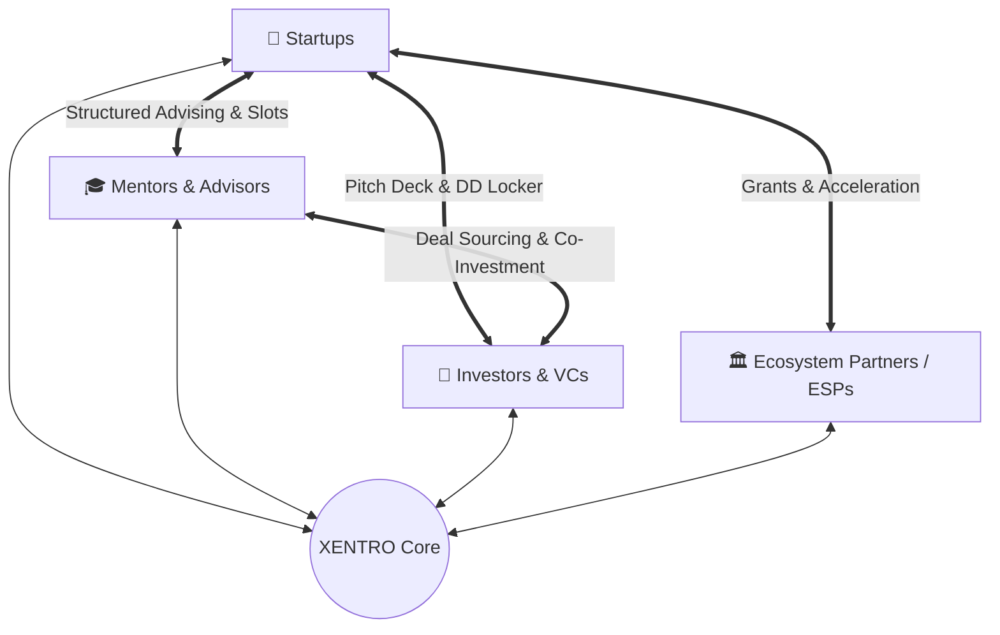
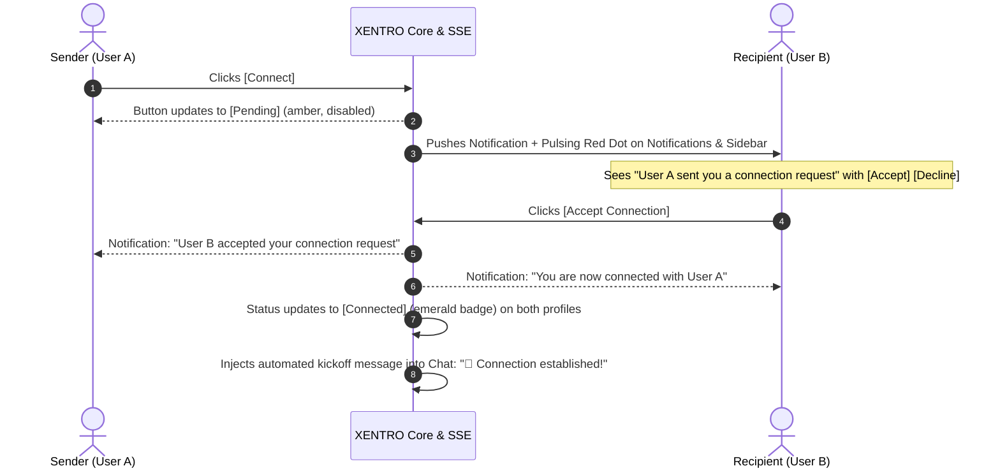

# XENTRO — Unified Venture & Ecosystem Platform

> **"Connect People. Create Opportunity."**  
> A next-generation, decentralized ecosystem operating system uniting **Startups**, **Mentors**, **Investors**, and **Ecosystem Service Providers (ESPs)** into a single collaborative platform with native real-time messaging, intelligent connection workflows, virtual data rooms (DD Lockers), and structured mentorship programs.

---

## 📑 Table of Contents

1. [Platform Vision & Core Personas](#1-platform-vision--core-personas)
2. [Technology Stack & Architecture](#2-technology-stack--architecture)
3. [Real-Time Communication Engine](#3-real-time-communication-engine)
4. [Connection & Social Graph Lifecycle](#4-connection--social-graph-lifecycle)
5. [Role-Specific Dashboards & Modules](#5-role-specific-dashboards--modules)
6. [Interactive Profile Views & Virtual Data Rooms](#6-interactive-profile-views--virtual-data-rooms)
7. [Feed, Content & Community Dynamics](#7-feed-content--community-dynamics)
8. [Codebase Map & Directory Structure](#8-codebase-map--directory-structure)
9. [API Route Specifications](#9-api-route-specifications)
10. [Automated Testing & Verification](#10-automated-testing--verification)
11. [Setup, Execution & Deployment Guide](#11-setup-execution--deployment-guide)

---

## 1. Platform Vision & Core Personas

Traditional startup networks are fragmented across multiple disconnected tools: LinkedIn for social connections, Pitchbook for discovery, DocSend for pitch decks, Calendly for meetings, and Slack or email for messaging.

**XENTRO** unifies these critical workflows into one frictionless, high-aesthetic platform tailored for four interconnected personas:



### The 4 Ecosystem Personas:
1. **Startups (`startup`)**: Early and growth-stage companies showcase their vision, traction metrics, team hierarchy, open asks, and virtual Due Diligence (DD) Lockers.
2. **Mentors (`mentor`)**: Industry leaders and angel advisors offering advisory slots, structured curriculums, office hours, and deal mentorship.
3. **Investors (`investor`)**: Angels, syndicates, and venture capital funds discovering deal flow, requesting data room access, evaluating traction, and collaborating in review committees.
4. **Ecosystem Service Providers (`esp`)**: Incubators, accelerators, universities, grant agencies, and legal/cloud providers hosting programs, challenges, and credits.
5. **Platform Administrators (`admin`)**: Comprehensive governance, user verification, KYC audits, system health metrics, and ecosystem oversight.

---

## 2. Technology Stack & Architecture

| Layer | Technology | Details |
| :--- | :--- | :--- |
| **Framework** | Next.js 14.2 (App Router) | Hybrid Server & Client Components, Server Route Handlers |
| **Language** | TypeScript 5+ | Strict type safety across models, states, and API contracts |
| **Styling** | TailwindCSS 3.4 + Custom Design System | HSL curated palette, Dark/Light mode theme system, Glassmorphism |
| **Component Icons** | Lucide React | Modern vector iconography |
| **Real-Time Engine** | Server-Sent Events (SSE) + BroadcastChannel | Self-hosted, low-latency (<50ms) bidirectional sync |
| **State & Persistence** | In-Memory + Disk JSON Store + LocalStorage | `data/messages_store.json` & `data/connections_store.json` |
| **Network Binding** | `0.0.0.0:3000` | Ready for multi-device local network and production cloud deployment |

---

## 3. Real-Time Communication Engine

XENTRO includes a custom, **self-hosted real-time engine** designed to work out of the box without requiring external accounts, Firebase, or Supabase subscriptions.

### Architecture Diagram:

```
+----------------------------------------------------------------------------------------+
|                                    NEXT.JS SERVER                                      |
|                                                                                        |
|   +----------------------------+          +----------------------------------------+   |
|   |    /api/messages/stream    | <------+ |         lib/serverMessages.ts          |   |
|   |  (Server-Sent Events: SSE) |          |  - Global in-memory pub/sub registry   |   |
|   +--------------+-------------+          |  - Persistent data/messages_store.json |   |
|                  |                        |  - Persistent data/connections_store   |   |
|                  |                        +--------------------+-------------------+   |
|                  |                                             ^                       |
|                  |                      POST /api/messages     |                       |
|                  |                      POST /api/connections  |                       |
+------------------|---------------------------------------------|-----------------------+
                   |                                             |
                   v                                             |
+--------------------------------------+       +-----------------+-----------------------+
|        CLIENT 1 (e.g. Laptop A)      |       |         CLIENT 2 (e.g. Laptop B)        |
| - EventSource ('/api/messages/stream')       | - EventSource ('/api/messages/stream')  |
| - BroadcastChannel ('xentro_chat')   |       | - BroadcastChannel ('xentro_chat')     |
| - Optimistic UI rendering            |       | - Optimistic UI rendering               |
+--------------------------------------+       +-----------------------------------------+
```

### Key Capabilities:
* **Dual Real-World Accounts**:
  * **Xentro Technologies** (`XU-902411`): Enterprise SaaS & Venture Platform
  * **Neeraj Nani** (`XU-765776`): Principal Tech Architect & Angel Advisor
* **Multi-Tab Instant Sync**: Uses `BroadcastChannel('xentro_realtime_chat')` for instantaneous 0ms synchronization across open tabs in the same browser.
* **Cross-Laptop Local Wi-Fi Sync**: Uses Server-Sent Events (`/api/messages/stream`) to stream messages and notifications across different computers on the same network or over the internet.
* **Resilience & Auto-Reconnect**: Automatic keep-alive heartbeats every 20 seconds and graceful reconnection on network dropouts.
* **Intelligent Auto-Reply Simulator**: Optional assistant bot toggle (`[Auto]`) for single-user testing scenarios.

---

## 4. Connection & Social Graph Lifecycle

XENTRO implements a professional, multi-stage social connection workflow identical to enterprise networking standards:



### Lifecycle States:
| State | Button Display | Action Available | Notification Trigger |
| :--- | :--- | :--- | :--- |
| **`none`** | `[+ Connect]` | Sends request to target profile | Dispatches connection request notification to recipient |
| **`pending`** | `[🕒 Pending]` | Disabled (prevents spam/duplicate requests) | None (waiting for approval) |
| **`received`** | `[✓ Accept Request]` | Recipient can approve or decline | Informs recipient of incoming request |
| **`connected`** | `[✓ Connected]` | Displays active relationship status | Posts automated greeting in chat & sends dual notifications |

---

## 5. Role-Specific Dashboards & Modules

Each stakeholder role accesses a purpose-built workspace:

### 🚀 Startup Dashboard
* **Overview & Traction**: Real-time revenue run-rate, monthly burn, runway, active user growth, and investor updates.
* **Team & Permissions**: Granular role-based access control (`Owner`, `Admin`, `Member`, `Observer`) with permission drawers for finances, pitch decks, and talent asks.
* **Opportunity Manager**: Browse curated grants, VC allocations, and accelerator cohorts with application status tracking.
* **Content Manager**: Draft, schedule, and broadcast posts to both the company profile and the global ecosystem feed.

### 🎓 Mentor Dashboard
* **Advisory Overview**: Mentorship inquiries, session hours completed, active mentees, and platform ratings.
* **Structured Offerings**: Manage 1-on-1 programs, technical architecture deep-dives, pitch deck polishing, and office hours.
* **Meeting Slots Scheduler**: Manage available time slots, duration options (15m, 30m, 45m), and video/audio meeting formats.
* **Mentorship History**: Review past mentorship sessions, founder feedback, and action items.

### 💼 Investor Dashboard
* **Deal Flow Pipeline**: Filter startups by stage (Pre-Seed, Seed, Series A), sector (AI, SaaS, Fintech), and traction metrics.
* **Due Diligence (DD) Room**: Request, review, and track access to locked data rooms, cap tables, and audit materials.
* **Portfolio Tracker**: Monitor invested portfolio companies, growth KPIs, and quarterly reports.

### 🏛️ ESP (Ecosystem Partner) Dashboard
* **Programs & Accelerators**: Publish hackathons, incubation cohorts, and grant opportunities.
* **Resource Credits**: Distribute legal, accounting, cloud credits, and technical services to community startups.

### 🛡️ Admin Governance Dashboard
* **Ecosystem Insights**: System health, active session counts, and cross-role interaction rates.
* **KYC & Verification**: Approve or deny founder credentials, verified mentor badges, and investor accredited status.

---

## 6. Interactive Profile Views & Virtual Data Rooms

### 1. Startup Profile View (`StartupProfileView.tsx`)
* **Interactive Pitch Deck Viewer**: Slide-by-slide interactive deck viewer with zoom, fullscreen, and download capabilities.
* **Elevator Pitch Video Modal**: Integrated video player for founder pitch demonstrations.
* **Due Diligence (DD) Locker**:
  * Three-tiered visibility: *Public*, *Connections Only*, and *Restricted (Request Required)*.
  * Encrypted file categories: Legal Incorporation, Financial Statements, Cap Table, IP & Patents, Traction Audits.
  * Access request flow: Investors request access $\rightarrow$ Founder approves for 14-day window.
* **Startup Asks & Open Roles**: Interactive cards for funding targets, hiring asks, and partner requests.

### 2. Mentor Profile View (`MentorProfileView.tsx`)
* **Public Preview Mode**: Automatically detects own profile and switches external CTAs ("Connect", "Book Meeting") to *"Viewing Public Preview"* and *"Manage Workspace"*.
* **Meeting Booking Engine**: Instant session scheduler supporting Discovery Calls, Deep Dives, and Pitch Reviews.
* **Structured Mentorship Request Modal**: Step-by-step wizard allowing founders to submit startup stage, challenges, and mentorship goals.

---

## 7. Feed, Content & Community Dynamics

* **Dynamic Top Navigation**: Greets the active persona dynamically (`Welcome {UserName}`), updating instantly when switching roles or updating names.
* **Rich Post Composer**: Create ecosystem updates with milestone tags, image attachments, opportunity asks, and category filters.
* **Two-Way Interactivity**: Real-time likes, comment persistence, and shareable links.
* **Entity Profile Routing**: Clicking any author avatar or name across the feed smoothly opens their public profile view with DD Locker access.

---

## 8. Codebase Map & Directory Structure

```
NewPro/
├── app/                                 # Next.js App Router root
│   ├── api/                             # Server Route Handlers
│   │   ├── connections/route.ts         # Connection REST API (GET/POST)
│   │   ├── messages/route.ts            # Messaging REST API (GET/POST)
│   │   └── messages/stream/route.ts     # Real-time SSE Stream (GET text/event-stream)
│   ├── globals.css                      # Global Tailwind and font styles
│   ├── layout.tsx                       # Root HTML layout with dark mode hydration
│   ├── page.tsx                         # Main Dashboard application entry
│   ├── signin/page.tsx                  # Authentication Sign-in portal
│   └── signup/page.tsx                  # Persona-based registration portal
├── components/                          # React Component Library
│   ├── dashboard/                       # Core Dashboard Views
│   │   ├── DashboardLayout.tsx          # Main layout orchestrator & custom tab router
│   │   ├── Header.tsx                   # Top navigation, search, dynamic greeting & alerts
│   │   ├── Sidebar.tsx                  # Collapsible sidebar with real-time badges
│   │   ├── Feed.tsx                     # Social ecosystem timeline & post composer
│   │   ├── PostCard.tsx                 # Feed item with likes, comments, and profile links
│   │   ├── MessagesWidget.tsx           # Floating real-time chat popup with auto-reply
│   │   ├── FullMessagesPage.tsx         # Dedicated full-screen messaging center
│   │   ├── NotificationsView.tsx        # Activity feed with Accept/Decline action buttons
│   │   ├── StartupProfileView.tsx       # Comprehensive startup profile & DD locker
│   │   ├── MentorProfileView.tsx        # Mentor profile, meeting slots & offerings
│   │   ├── InvestorProfileView.tsx      # Investor thesis, AUM, and portfolio
│   │   ├── ESPProfileView.tsx           # Partner services & incubation programs
│   │   └── startup/                     # Startup management modules (team, metrics, asks)
│   └── ui/                              # Reusable UI primitives (Toast, modals, badges)
├── data/                                # Local Persistence & Seed Data
│   ├── messages_store.json              # Server message storage
│   ├── connections_store.json           # Server connection records
│   └── mentorProfilesData.ts            # Seeded mentor records & offerings
├── lib/                                 # Business Logic, Services & Real-Time Engine
│   ├── serverMessages.ts                # Server-side state store & SSE pub/sub engine
│   ├── messagingService.ts              # Client-side chat, SSE listener & BroadcastChannel
│   ├── connectionService.ts             # Connection lifecycle & notification triggers
│   ├── notificationService.ts           # Notification store, dispatch & clear actions
│   ├── userProfile.ts                   # Active user profile and persona switching
│   └── feedService.ts                   # Social feed storage, liking, and commenting
├── types/                               # TypeScript Definitions & Interfaces
│   ├── index.ts                         # Core types (User, Post, Conversation, Message)
│   ├── mentor.ts                        # Full mentor profiles, offerings & meeting slots
│   └── startup.ts                       # Startup profiles, DD lockers, asks & financials
├── package.json                         # Scripts & dependencies (Next 14, Tailwind, Lucide)
├── tsconfig.json                        # TypeScript configuration (Strict mode)
├── tailwind.config.js                   # Tailwind CSS configuration with custom theme tokens
└── BAK-work.md                          # Detailed session audit & verification backup
```

---

## 9. API Route Specifications

### 1. `GET /api/messages`
* **Description**: Returns all shared chat messages.
* **Response**:
  ```json
  {
    "success": true,
    "messages": [
      {
        "id": "msg_seed_1",
        "senderId": "XU-902411",
        "senderName": "Xentro Technologies",
        "text": "Hi Neeraj, we are gearing up for our seed round...",
        "timestamp": "10:00 AM",
        "readBy": ["XU-902411", "XU-765776"]
      }
    ]
  }
  ```

### 2. `POST /api/messages`
* **Description**: Sends a message or updates read status.
* **Payload (Send)**:
  ```json
  {
    "action": "send",
    "message": {
      "id": "msg_123",
      "senderId": "XU-902411",
      "senderName": "Xentro Technologies",
      "text": "Hello from our startup team!",
      "timestamp": "04:30 PM",
      "readBy": ["XU-902411"]
    }
  }
  ```
* **Payload (Mark Read)**:
  ```json
  {
    "action": "markRead",
    "userId": "XU-765776"
  }
  ```

### 3. `GET /api/messages/stream`
* **Description**: Server-Sent Events (SSE) streaming endpoint.
* **Headers**: `Content-Type: text/event-stream`, `Connection: keep-alive`
* **Events**:
  * `init`: Full message history on connection.
  * `new_message`: Pushed whenever any user sends a message.
  * `connection_event`: Pushed whenever a connection is requested, accepted, or declined.
  * `: keep-alive`: Periodic heartbeat every 20 seconds.

### 4. `GET /api/connections`
* **Description**: Returns all established and pending connection records.

### 5. `POST /api/connections`
* **Description**: Dispatches connection lifecycle actions (`request`, `accept`, `decline`).
* **Payload**:
  ```json
  {
    "action": "request",
    "connection": {
      "id": "conn_XU-902411_XU-765776",
      "senderId": "XU-902411",
      "senderName": "Xentro Technologies",
      "senderRole": "Enterprise SaaS",
      "recipientId": "XU-765776",
      "recipientName": "Neeraj Nani",
      "recipientRole": "Principal Tech Architect",
      "status": "pending",
      "createdAt": "2026-10-05T04:20:00.000Z",
      "updatedAt": "2026-10-05T04:20:00.000Z"
    }
  }
  ```

---

## 10. Automated Testing & Verification

The codebase has undergone strict automated verification:

### Test Suite Execution:
```bash
npm run typecheck
```
* **Result**: `tsc --noEmit` exited with **0 errors**.

### Automated Route & Flow Tests (8/8 Passed):
```
✓ GET / (Home Page — 200 OK)
✓ GET /signin (Sign-in Page — 200 OK)
✓ GET /signup (Registration Page — 200 OK)
✓ GET /api/messages (Messages retrieval — 200 OK)
✓ GET /api/connections (Connections retrieval — 200 OK)
✓ POST /api/connections (Connection Request flow — 200 OK)
✓ POST /api/connections (Connection Acceptance flow — 200 OK)
✓ POST /api/messages (Real-time message dispatch — 200 OK)

--- ALL 8 OF 8 TESTS PASSED ---
```

### Production Build Verification:
```bash
npm run build
```
* **Result**: Compiled 12/12 static and dynamic routes successfully with optimized bundle sizes.

---

## 11. Setup, Execution & Deployment Guide

### Prerequisites
* **Node.js**: v18.17.0 or higher
* **npm**: v9.0.0 or higher

### 1. Installation
Clone the repository and install dependencies:
```bash
cd NewPro
npm install
```

### 2. Local Development
Start the dev server (automatically binds to all network interfaces on port 3000):
```bash
npm run dev
```
Open [http://localhost:3000](http://localhost:3000) in your browser.

### 3. Testing Across Two Laptops on the Same Wi-Fi
1. Start the server on Laptop A:
   ```bash
   npm run dev
   ```
2. Find Laptop A's local IPv4 address (run `ipconfig` on Windows or `ifconfig` on macOS/Linux, e.g. `192.168.1.50`).
3. On Laptop B (connected to the same Wi-Fi), open the browser and navigate to:
   ```
   http://192.168.1.50:3000
   ```
4. Both laptops can now send messages, request connections, and receive real-time notifications from each other with zero cloud configuration.

### 4. Production Cloud Deployment
XENTRO is 100% cloud-ready and can be deployed in one click to:
* **Vercel**: `vercel deploy`
* **Railway**: Connect GitHub repository $\rightarrow$ automatic deployment.
* **Render / VPS**: Standard Node.js container running `npm run build && npm run start`.

No external database provisioning or API keys are required for the real-time engine to operate.

---

**© 2026 XENTRO Technologies. Connect People. Create Opportunity.**
